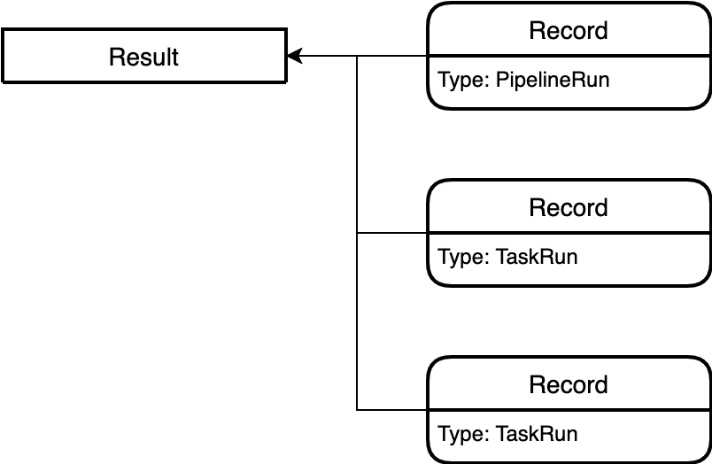

# Tekton Results API

This project supports a richly queryable API for Tekton execution history and results.

The main components of this design are a **queryable API server** backed by
persistent storage, and an **in-cluster watcher** to report updates to the API
server.

The full motivation and design are available in
[TEP-0021](https://github.com/tektoncd/community/blob/master/teps/0021-results-api.md).

See [proto/v1alpha2](proto/v1alpha2) for the latest Results API spec.

## Quickstart

Results does not have an official release at the moment. In the meantime, see
the [DEVELOPMENT quickstart guide](DEVELOPMENT.md#quickstart) for installing
from source.

## Data Model

- Records are individual instances of data. These will commonly be execution
  data (e.g. PipelineRun, TaskRuns), but could also reference additional data
  about the event/execution. Records are intended to be flexible to support
  arbitrary information tools want to provide around a CI event.
- Results are aggregators of Records, allowing users to refer to groups of
  Records as a single entity. For example, you might have a single Result that
  groups the following Records:
  - Source Event (e.g. pull request, push) that kicked off the action.
  - The PipelineRun that occurred.
  - The TaskRuns that occurred in response of the PipelineRun (one per Task).
  - Receipt of Cloud Event delivery.
  - Receipt of Source status update.

(Note: not all of these types of data are supported by the Watcher yet, but are
examples of the data we intend to support).

## Helpful links

- [Roadmap](docs/roadmap.md)

## Contact

- [Tekton Community](https://github.com/tektoncd/community/blob/master/contact.md)
- [#results - Tekton Slack](https://tektoncd.slack.com/archives/C01GCEH0FLK)