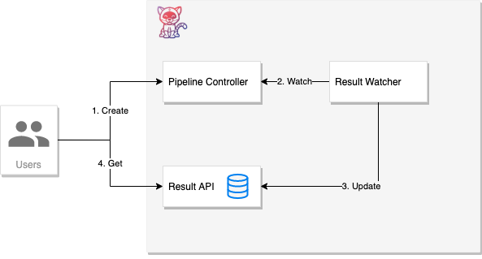
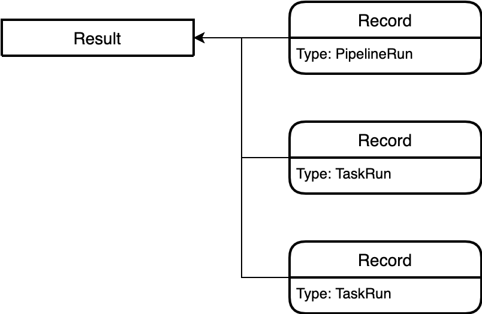

<!--

---
linkTitle: "Results"
weight: 2
description: >
  Result storage for Tekton CI/CD data.
cascade:
  github_project_repo: https://github.com/tektoncd/results
---

-->

# Tekton Results

Tekton Results aims to help users logically group CI/CD workload history and
separate out long term result storage away from the Pipeline controller. This
allows you to:

- Provide custom Result metadata about your CI/CD workflows not available in the
  Tekton TaskRun/PipelineRun CRDs (for example: post-run actions)
- Group related workloads together (e.g. bundle related TaskRuns and
  PipelineRuns into a single unit)
- Make long-term result history independent of the Pipeline CRD controller,
  letting you free up etcd resources for Run execution.

Additional background and design motivations can be found in
[TEP-0021](https://github.com/tektoncd/community/blob/main/teps/0021-results-api.md).

## Overview

Tekton Results is composed of 2 main components:

- A [queryable gRPC API server](api/) backed by persistent storage (see
  [proto/v1alpha2](../proto/v1alpha2) for the latest API spec).
- A [controller to watch and report](watcher/) TaskRun and PipelineRun updates
  to the API server.

### Life of a Result

1. User creates a TaskRun or PipelineRun via the Kubernetes API as usual.
2. Result Watcher listens for all TaskRun/PipelineRun changes.
3. If a TaskRun/PipelineRun has changed, Watcher updates (or creates) a
   corresponding `Record` (and `Result` if necessary using the Results API.

- Watcher will also annotate the original TaskRun/PipelineRun with identifiers
  as well.

4. Users can get/query Result/Record data directly from the API. Once the
   TaskRun/PipelineRun is complete and has been successfully stored in the
   Result API, the original CRD object can be safely removed from the cluster.

## Getting Started

1. [Installation](install.md)
2. [Results API](api/README.md): Learn how to connect to the API and make
   queries.
3. [Watcher](watcher/README.md): Learn what types the Watcher supports and how
   it determines Result groupings.

## Data Model

- Records are individual instances of data. These will commonly be execution
  data (e.g. PipelineRun, TaskRuns), but could also reference additional data
  about the event/execution. Records are intended to be flexible to support
  arbitrary information tools want to provide around a CI event.
- Results are aggregators of Records, allowing users to refer to groups of
  Records as a single entity. For example, you might have a single Result that
  groups the following Records:
  - Source Event (e.g. pull request, push) that kicked off the action.
  - The PipelineRun that occurred.
  - The TaskRuns that occurred in response of the PipelineRun (one per Task).
  - Receipt of Cloud Event delivery.
  - Receipt of Source status update.

(Note: not all of these types of data are supported by the Watcher yet, but are
examples of the data we intend to support).

## Helpful links

- [Roadmap](roadmap.md)
- [Results API Query Cookbook](api/README.md#cookbook)

## Contact

- [Tekton Community](https://github.com/tektoncd/community/blob/main/contact.md)
- [#results - Tekton Slack](https://tektoncd.slack.com/archives/C01GCEH0FLK)
